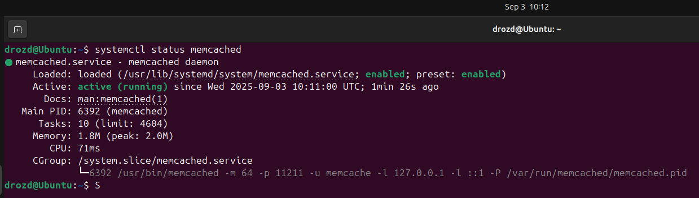
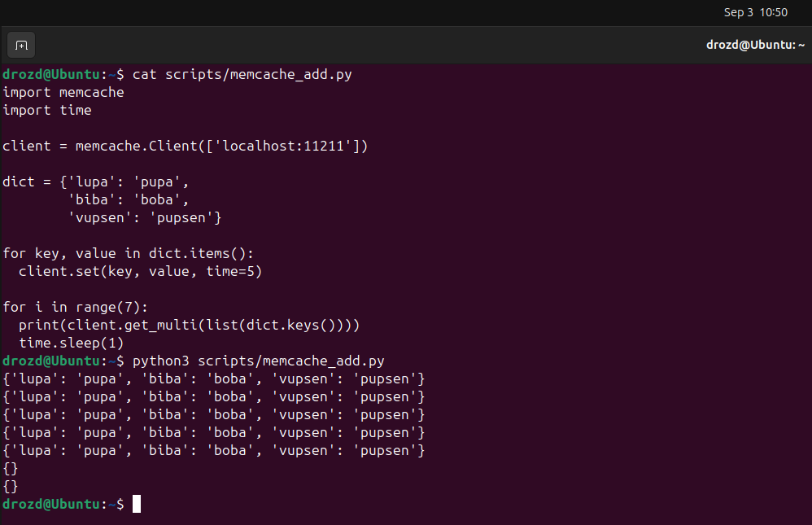
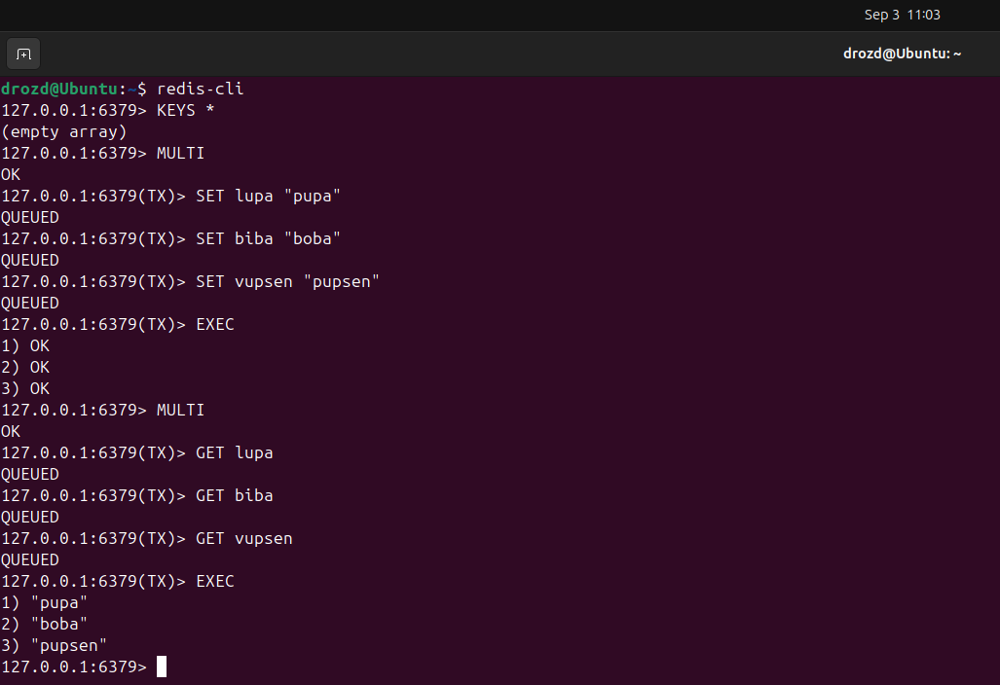
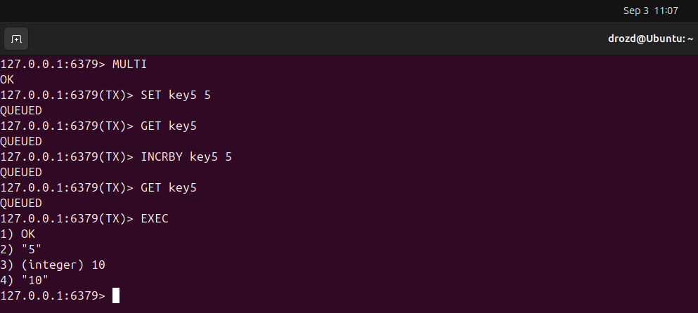

# Домашнее задание к занятию "`Кеширование Redis/memcached`" - `Гривняшкин Роман`

---

### Задание 1

1. `Кэширование позволяет оптимизировать задержки. Чем востребованнее данные, тем они доступнее. Мой дом - это ПЗУ, карманы - ОЗУ, а кошелек, который я достал на кассе - кэш.`
2. `Снижение нагрузки на сеть и узлы путем сокращения одинаковых запросов. Зачем после каждой шутки говорить, что это шутка, если можно просто поднимать готовую табличку "сарказм"?`
3. `Повышение отказоустойчивости. Если откажет основное хранилище, кэш сможет какое-то время поддерживать работу за счет имеющихся, пусть и устаревших данных. Надежда умирает последней. До нее умирает кэш.`

---

### Задание 2

---

### Задание 3

---

### Задание 4

---

### Задание 5

